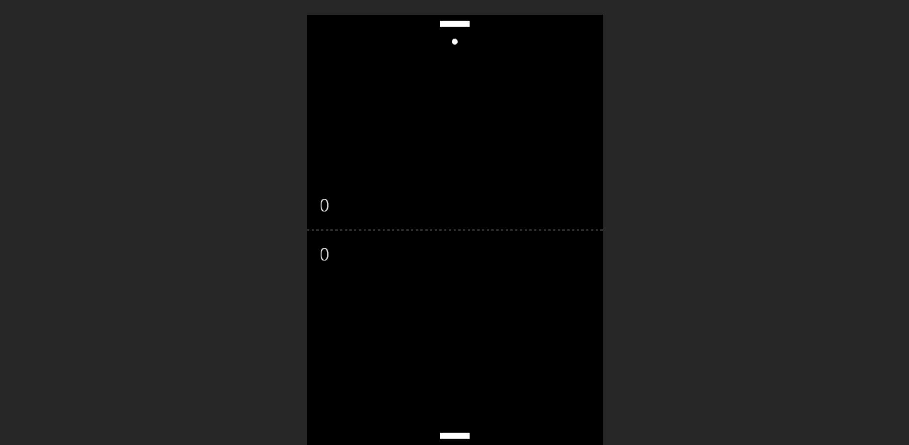

# pong

## Description

The classic game Pong recreated using HTML canvas. The game is played by the player bouncing the game ball back at the computer paddle. The paddle tracks the movement of the ball. The player controls their paddle by swipping left and right on their trackpad. The first to reach the score of 7 between the computer and player wins. When the score limit is reached a game over screen is displayed to the player. The screen displays the winner of the match and gives the player the option to play again. This game is created by using the HTML canvas element, css for the project style, and JavaScript for the game logic.

## Demo

A demo of the game can be played by following the link: https://tod619.github.io/pong/
